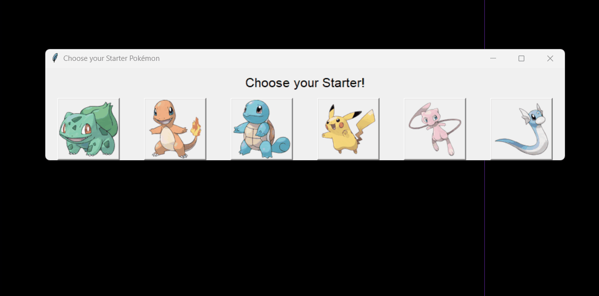

# Pokémon Route

A hybrid **Prolog + Python** game that combines symbolic logic programming, fuzzy inference, and a Tkinter GUI: pick a starter Pokémon, then watch it autonomously battle its way across a 5×5 map of wild Pokémon, deciding at every step which neighboring room gives it the best odds of winning.

> Built as a university AI group project



## How It Works

1. **Pick a starter** - a Tkinter window lets you choose between different pokemons, like: Bulbasaur, Charmander, Squirtle, Pikachu, Mew, and Dratini.
2. **Explore the map** - the world is a 5×5 grid where every room holds a wild Pokémon and a level, defined as **facts in a Prolog knowledge base**. The player starts in the top left of the room.
3. **Decide where to go** - for every reachable, unvisited neighboring room, the game estimates the *probability of winning* a battle there using a **fuzzy logic controller**, based on:
   - the level difference between your Pokémon and the wild one, and
   - your best possible type-effectiveness multiplier against it (looked up from a Prolog type chart, Pokémon-style: fire beats grass, water beats fire, etc.).
   
   The room with the highest predicted win probability is chosen next - a small greedy decision agent.
4. **Battle** - a turn-based fight plays out automatically (with a chance of a missed hit or a critical hit each turn), and your Pokémon's level moves up or down depending on the result.
5. **Repeat** - the GUI animates your Pokémon sliding across the grid to the next room, and the loop continues until either every room has been visited (win) or your Pokémon runs out of HP (game over). If every neighboring room has already been explored, the game wanders to a random adjacent cell to keep searching.

## Features

- **Prolog knowledge base** for spatial reasoning (map connectivity, valid neighbors, bounds checking) and game data (the full type-effectiveness chart and a ~150-entry Pokémon list with types).
- **Fuzzy inference system** (via `scikit-fuzzy`) with 3 linguistic variables and 12 rules, translating "how much stronger/weaker is this matchup" into a win probability instead of a hard-coded formula.
- **Python ↔ Prolog integration** through `pyswip`, so the Python game loop queries the Prolog rules live instead of duplicating logic.
- **Animated Tkinter GUI** - smooth tile-to-tile sliding movement, plus a separate starter-selection screen.
- **Configurable map** - the 5×5 route (which Pokémon/level sits in each room) is entirely data-driven from `pokemon_route.pl`, so new maps can be authored without touching any code.

## Architecture

```
├── docs/  
├── main.py                      # Wires the starter screen, game logic, and GUI together
├── game/
│   ├── pokemon_game.py          # Core game loop: room evaluation, battles, leveling
│   └── pokemon_fuzzy.py         # Fuzzy logic controller (level diff + type effect → win probability)
├── gui/
│   ├── starter_gui.py           # Starter-selection screen
│   └── pokemon_gui.py           # Main map GUI + movement animation
├── prolog/
│   ├── pokemon_game.pl          # Map/grid rules: bounds, neighbors, reachable rooms
│   ├── pokemon_list.pl          # Pokémon database (id, name, types)
│   ├── pokemon_info_attacks.pl  # Type-effectiveness chart
│   └── pokemon_route.pl         # The 5×5 map layout (which Pokémon + level per room)
├── images/                      # Sprites used by the GUI
└── requirements.txt
```

The split mirrors what each language is good at: **Prolog** expresses the map and game-data facts/rules declaratively (easy to read, easy to extend), while **Python** handles the fuzzy decision-making, battle simulation, and rendering.

## Tech Stack

- **Python 3** - game loop, GUI (Tkinter), fuzzy logic
- **Prolog (SWI-Prolog)** - map reasoning and game-data facts, queried via `pyswip`
- **`scikit-fuzzy`** - fuzzy inference for battle-outcome estimation
- **Pillow (PIL)** - image loading/resizing for the GUI

## Running the Project

**Requirements:**
- Python 3.9+
- [SWI-Prolog](https://www.swi-prolog.org/) installed and available on your system (required by `pyswip`)
- Python packages: `pyswip`, `pillow`, `numpy`, `scikit-fuzzy`

```bash
pip install -r requirements.txt
```

**Run:**
```bash
python main.py
```

Pick a starter in the popup window, and the game plays itself out on the map - no further input needed.

## Author

**Gonçalo Sobral** - [GSobral99](https://github.com/GSobral99)
**Rafael Silva**